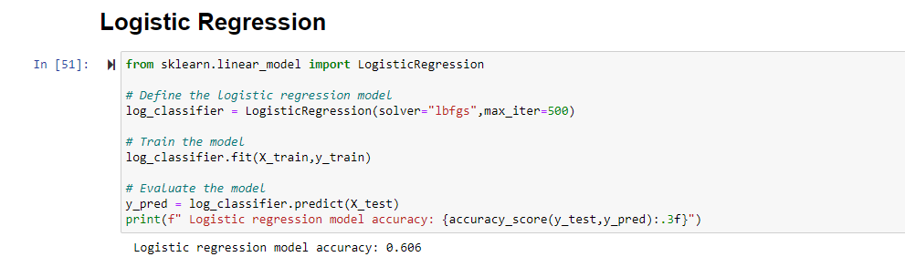

# Machine Learning Model
When it comes to determining whether one should consider purchasing a specific stock at their initial public offering, the anticipation of selling that stock at a higher price vs. the price they had bought it is the primary goal. 

We can observe this through the stock's return, which is the selling price per stock minus the price the stock was bought at. So in deciding on our target for our Model, we decided that the **stock price return** would be our target, and using financial metrics that would influence a stock's return would be our features. 

# Feature Engineering and Feature Selection

## Target Selection

While our primary target is the stock price return, we decided to explore two specific features of the IPO's in our dataset:

1. Three Month Return
    -  IPO's may have conditions set where there is a period of time at which an IPO's shares are prohibited from being sold until a pre-specified time had passed. 
    - Typically this pre-specified 'IPO Lock-up' ranges from 90 to 120 days, so observing the stock's price after three months allows us to see its performance when the stock can be sold.
2. First Day Closing Price
    - During an IPO, a large increase between the initial offer price and price of the stock at the end of the first day is labeled as the 'IPO pop'.
    - Some may attribute the first day IPO pop as an indicator of success and demand for that stock.

## Feature Selection 
-  Potential features we decided to include and test since these are relevant Key Performance Indicators (KPIs)/ Business metrics to determine company performance which could influence a company's **stock price**
    - Net Profit Margin
		- This is the percentage of total profit over total sales made by the company. It is the percentage of sales remaining after all expenses, interest, taxes and preferred stock dividends have been deducted from total revenue
        - Indicates the company's ability to bring money from its regular operations
	- Gross Margin
	    - This metric is especially important for starting companies as it reflects on improved processes and production
	- Debt Asset Ratio
        - For shareholders, this is a good indicator of where a company's assets are held. Whether the bulk of assets are owned by the shareholders vs. creditors
	- Current Ratio
        - This is a financial KPI that measure the company's ability to pay off its short term financial obligations in one year.

## Feature Importance

To find which features were most impactful on our models, we implemented Permuation Importance on our features used - which displays features and their weights on our models.

### Feature Importance on Three Month Return:
</img>

With three month return as our target, Net Profit Margin was the most important feature for its model

### Feature Importance on First Day Closing Price:
</img>

But for our First Day Closing Price model, Operating Cashflow and Cashflow from Investment looked to be much more impactful.

# Preliminary Data Preprocessing

- To convert our categorical variable data into indicator variables of 0 or 1, we used panda's .get_dummies
- Preprocessing on our calculated columns which serve as our selected features such as Debt-to-Asset ratio and Net Profit Margin, had to be done before they could be introduced into our model.
    - any N/A's, or infinite values had to be removed

# Model Choices

## Training/Testing Split

- During Training/Testing our models, the highest accuracy found for both Three Month Return and First Day Closing Price was found when using a 67% training and 33% testing split

## Model Selection

- Since we have labeled data, we've tried using a variety of different binary classification models:
    - Logistic Regression
</img>
    - Random Forest
    </img>
    - Support Vector Machine - SVM  
    - Deep Learning
- Our most successful results so far were found using **Deep Learning**
    - using all our 10 features, our models performed:
        - ~65% accuracy - Three Month Return model
        </img>
        - ~60% accuracy - First Day Closing Price model
        </img>

## Attempts at Model Optimization

In attempts to optimize our model and achieve higher accuracy, the models were observed as features were added/removed. 

## Overfitting

Though modeling with Deep Learning allows it to handle many features, it is prone to overfitting. Our first attempts resulted in high training accuracy while our testing set would be low.

To counter-act overfitting, we reduced our neuron count from 2x our input features to 1.5. We also removed a hidden layer:
   </img>

Doing this resulted in our 65% and 60% accuracy on our three day return and first day close models respectively.

# To be attempted
- Explore sector specific features
    - there are many different features at which people would value certain companies more depending on the specific 
    - different businesses have could have different emphasis on different metrics
    - ie. manufacturing KPI vs merchandising KPI
