# Machine Learning Model
When it comes to determining whether one should consider purchasing a specific stock at their initial public offering, the anticipation of selling that stock at a higher price vs. the price they had bought it is the primary goal. 

We can observe this through the stock's return, which is the selling price per stock minus the price the stock was bought at. So in deciding on our target for our Model, we decided that the **stock price return** would be our target, and using financial metrics that would influence a stock's return would be our features. 

# Feature Engineering and Feature Selection

## Target Selection

While our primary target is the stock price return, we decided to explore two specific features of the IPO's in our dataset:

1. Three Month Return
    -  IPO's may have conditions set where there is a period of time at which an IPO's shares are prohibited from being sold until a pre-specified time had passed. 
    - Typically this pre-specified 'IPO Lock-up' ranges from 90 to 120 days, so observing the stock's price after three months allows us to see its performance when the stock can be sold.
2. First Day Closing Price
    - During an IPO, a large increase between the initial offer price and price of the stock at the end of the first day is labeled as the 'IPO pop'.
    - Some may attribute the first day IPO pop as an indicator of success and demand for that stock.

## Feature Selection 
-  Potential features we decided to include and test since these are relevant Key Performance Indicators (KPIs)/ Business metrics to determine company performance which could influence a company's **stock price**. Our features can fall under 4 main categories:
    ### 1. Categorical Features:
   - The market’s receptiveness of each IPO will never be the same each issuance. We believe that it will differ largely based on the Sector and Industry of the company.

        | Feature | Description | 
        | :--- |:--- |
        | **Industry**| It refers to a part of the economy in which a great number of companies can be categorized and is larger in comparison to “Industry”. | 
        | **Sector**| It refers to a series of companies that operate in a similar business sphere, and its categorization is more narrow.    
    
    ### 2. Financial Health:
    - We believe that the market would also take into consideration of the company’s indebtedness and liquidity.

        | Feature | Description | 
        | :--- | :--- |
        |**Debt-to-Asset Ratio**| A leverage ratio that defines the total amount of debt relative to assets owned by the company.|
        |**Debt-to-equity Ratio**| It is a measure of the degree to which a company is financing its operations through debt versus wholly-owned funds|
        |**Current Ratio**| A liquidity metric that measures the company's ability to pay off its short term financial obligations in one year|
        |**Operating Cash Flow Ratio**| A measure of how readily current liabilities are covered by the cash flows generated from a company's operations. This ratio can help gauge a company's liquidity in the short term|

    ### 3. Operational Performance:
    - We believe that the market’s receptiveness of an IPO would be directly related to how well the company is performing. Specifically, it should be tied to a company’s profitability on different levels (gross, net, and earnings before accounting & financial deductions), as well as its ability to generate sufficient cash flow to maintain and grow its operations.

        | Feature | Description | 
        | :--- |:--- |
        | **EBITDA** | Earnings before interest, taxes, depreciation, and amortization, is a measure of a company's overall financial performance before the influence of accounting and financial deductions.  |
        | **Gross Profit Margin** | A measure of profitability that shows the percentage of revenue that exceeds the cost of goods sold. |
        | **Net Profit Margin**| It is the percentage of sales remaining after all expenses, interest, taxes and preferred stock dividends have been deducted from total revenue. |
        | **EBIT Margin** |  It is the percentage of sales remaining after all expenses (except interest and taxes) have been deducted from total revenue.
        
    ### 4. Long-term Planning
    - The market should also take into account of the company’s plan for the future. R&D and Cash Flow from Investment are good proxies that reflect the company’s willingness and preparedness for facing future challenges.

        | Feature | Description | 
        | :--- |:--- |
        **Research & Development (R&D)**| This is the amount of expenses in which the company devotes into developing or enhancing new products and services.|
        | **Cash Flow from Investments**| How much cash has been generated or spent from various investment-related activities in a specific period. Investing activities include purchases of physical assets, investments in R&D, investments in securities, or the sale of securities or assets.| 

## Feature Selection between Three Month and First Day Returns

While the above shows all of the features selected, our two models had their own set select features:

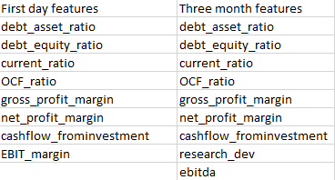

With the primary difference of EBIT margin being used in our First Day Return model, while EBITDA and Research & Development proved more beneficial to the Three Month Return model

## Features with Biggest Impact - Permutation Importance

To find which features were most impactful on our models, we implemented **Permuation Importance** on our features used - which displays features and their weights on our models.

### Feature Importance on Three Month Return:
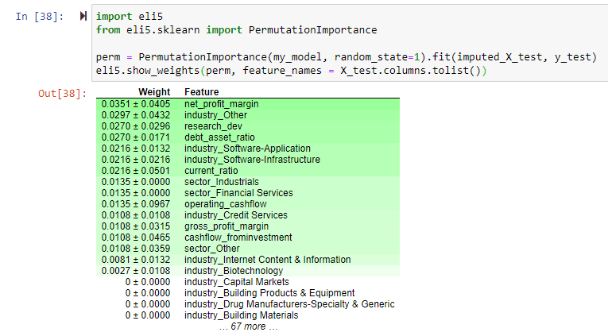</img>

With three month return as our target, Net Profit Margin was the most important feature for its model

### Feature Importance on First Day Closing Price:
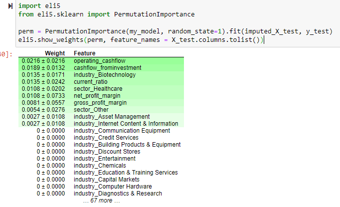</img>

But for our First Day Closing Price model, Gross Profit Margin, Cashflow from Investments and Operating Cashflow Ratio looked to be much more impactful.

# Preliminary Data Preprocessing

- To convert our categorical variable data into indicator variables of 0 or 1, we used panda's .get_dummies
- Preprocessing on our calculated columns which serve as our selected features such as Debt-to-Asset ratio and Net Profit Margin, had to be done before they could be introduced into our model.
    - any N/A's, or infinite values had to be removed

# Model Choices

## Training/Testing Split

- During Training/Testing our models, the highest accuracy found for both Three Month Return and First Day Closing Price was found when using a 67% training and 33% testing split

## Model Selection

- Since we have labeled data, we've tried using a variety of different binary classification models:
    - Logistic Regression (First Day Return)
</img>
    - Logistic Regression (Three Month Return)
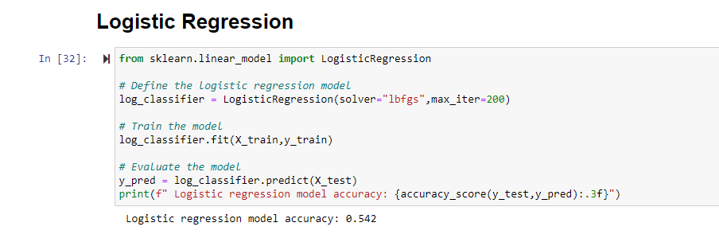</img>
    - Random Forest (First Day Return)
    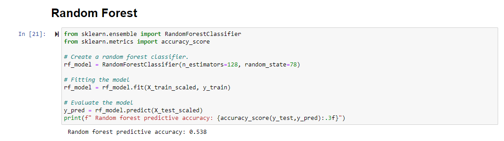</img>
    - Random Forest (Three Month Return)
    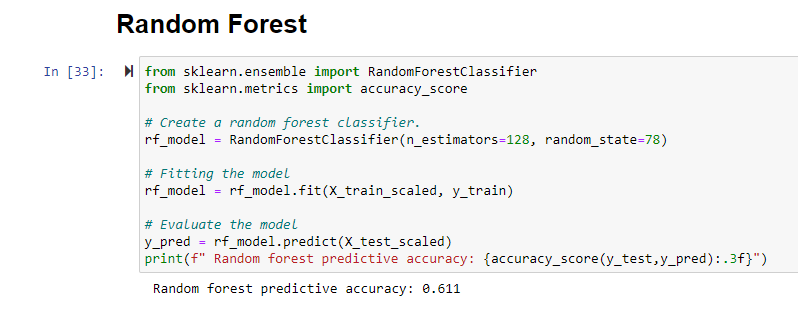</img>

- But our most successful results so far were found using **Deep Learning**
    - using our listed features stated [above](##FeatureSelectionbetweenThreeMonthandFirstDayReturns), our models performed:
        - ~69% accuracy - Three Month Return model
        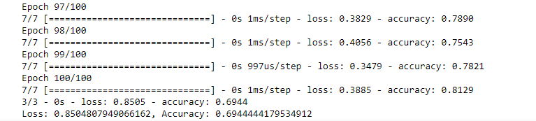</img>
        - ~65% accuracy - First Day Closing Price model
        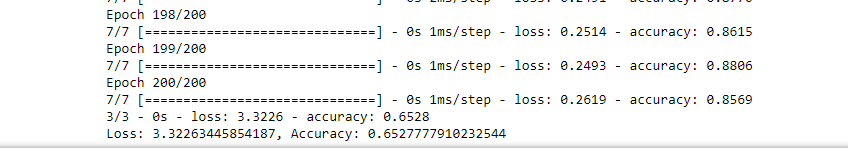</img>

## Attempts at Model Optimization
### Initial Attempt
In attempts to optimize our model and achieve higher accuracy, the models were observed as features were added/removed. 

Our initial features for both models consisted of: 
- Sector
- Industry
- Debt-to-Asset Ratio
- Current Ratio
- Gross Profit Margin
- Net Profit Margin
- Operating Cashflow
- Cashflow from Investment
- Research Development
- EBITDA

Initial results were as follows:

- ~65% accuracy - Three Month Return model
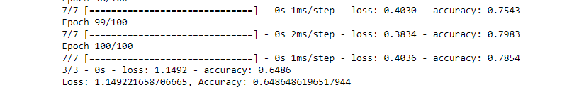</img>
- ~60% accuracy - First Day Closing Price model
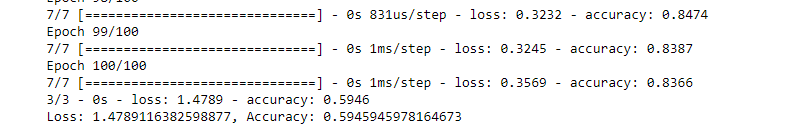</img>

## Overfitting

Though modeling with Deep Learning allows it to handle many features, it is prone to overfitting. Our first attempts resulted in high training accuracy while our testing set would be low.

To counter-act overfitting, we reduced our neuron count from 2x our input features to 1.5. We also removed a hidden layer:
   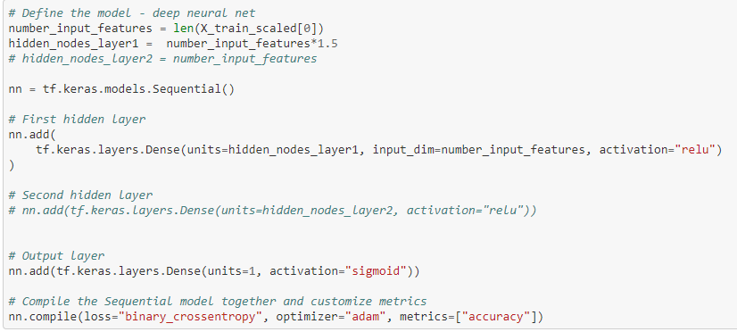</img>

Doing this resulted in our 65% and 60% accuracy on our Three Month Return and First Day Return models respectively.

## Features Adjusted

### <u>**First Day Return** - Accuracy Increased to 65% </u>

More attempts at increasing the accuracy of our model came about adding new features and adjusting features chosen. 

Features Removed:
- Operating Cash Flow
- EBITDA
- Research and Development

Features Added:
- Operating Cash Flow Ratio
- EBIT Margin
- Debt-to-Equity Ratio

While trying to avoid over-fitting by lowering neurons, epochs and removing a layer, attempting to increase our epochs and re-add an additional hidden layer to our neural network, resulted in increasing our model's accuracy without increasing our testing accuracy by much:

### First Day Return - New Features and Added Hidden Layer:
</img>

### <u>**Three Month Return** - Accuracy Increased to 69%</u>

In attempts to increase our Three Month Return Model, similar steps were taken, but ultimately adjusting features proved most beneficial - resulting in an accuracy of ~69%

Features Removed:
- Operating Cash Flow

Features Added:
- Operating Cash Flow Ratio
- Debt-to-Equity Ratio

### Three Month Return - After new Features added:
</img>

### <u>**Three Month Return** - Accuracy Increased to 71% </u>

The R&D feature was adjusted to an R&D ratio, which is the amount of R&D invested as a percentage of total revenue. This metric allows for the dollar amount of R&D more comparability between companies, which may have been the reason for a slightly better accuracy.

### Three Month Return - Replacing R&D with R&D Ratio:
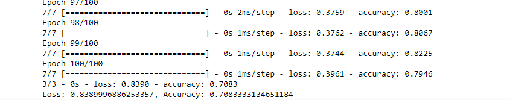</img>

## <u>Confusion Matrix</u>

To best describe the performance of our model, a confusion matrix is a good visualization of how precise and sensitive our model really is. 

Our **Confusion Matrix** is setup to show the outcomes of our binary classification of either Gain or Loss when it comes to returns on either the First Day or Three Month after an IPO has released.

The matrix compares actual outcomes and compares them to what the model predicted as either Gain or Loss. Looking at this comparison will result in determining how well our model can predict correctly, and how often.

First Day Return

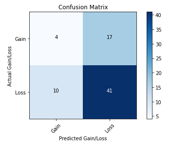</img>

Looking at First Day Return, of the 58 times that the model predicted a Gain:
- 41 times it was actually a Gain
- 17 times it was actually a Loss

And when it came to predicting a loss:
- 4 times it was actually  a Loss
- 10 times it was actually a Gain

Three Month Return

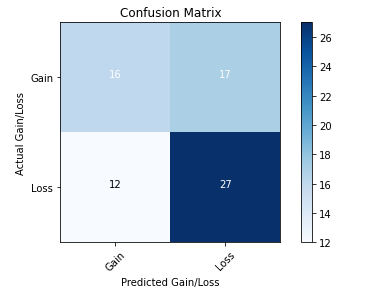</img>

For our Three Month Return 

When guessing a Gain:
- 27 it was actually a Gain
- 17 it was actually a Loss

When guessing a Loss:
- 16 it was actually a Loss
- 12 it was actually a Gain

So to use this information, to see how often we are correct is to determine the model's precision, and to see how often the model predicts a gain and its actually a gain is to determine its sensitivity/recall.

### Precision and Recall
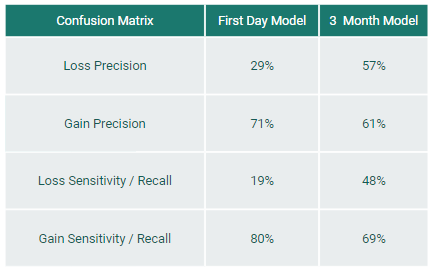</img>

For our first day model, its precision to predict a Gain is 71% whereas our Three Month has a precision of only 61%. So our first day is better at predicting a True Gain in IPO return but not when it comes to predicting a True Loss

WHen it comes to how often our model predicts a Gain when it is ACTUALLY a Gain? Our First month sensitivity is 80% of the time able to predict a Gain when its a Gain, and in our three month - 69%

## Loss function

For our loss function, since both our models are binary classifiers, **binary cross entropy** was used. This will measure the predicted probability by comparing it to the actual class output.

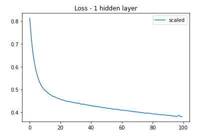</img>
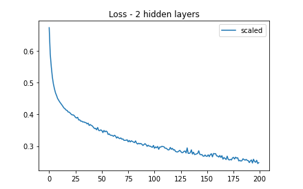</img>

# Conclusions

Of the two models, the Three Month Return model proves a stronger model. Able to accept more features while returning higher accuracy than the First Day Return Model proves to be much more useful.

This could be due to the First Day Stock price being a much more speculative period of an IPO, not all features that influences a stock price at IPO were considered.

How does this model benefit anyone? Does the model answer whether one should invest in an IPO?
- If the model was given the same parameters as our features, our Three Month Model with 69% accuracy will be able to guess whether their IPO would be successful in achieving a positive return after three months. This is significant, as three months is the typical period at which an IPO can be sold back on the market. 

