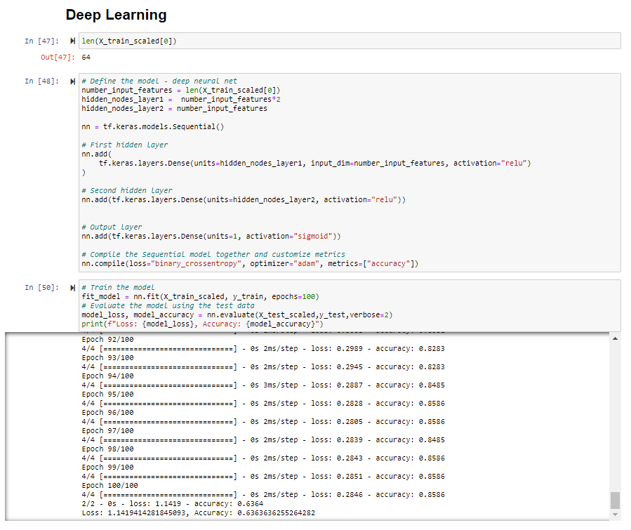

# Machine Learning Model

# Preliminary Data Preprocessing
- To convert our categorical variable data into indicator variables of 0 or 1, we used panda's .get_dummies
- Preprocessing on our calculated columns which serve as our selected features such as Debt-to-Asset ratio and Net Profit Margin, had to be done before they could be introduced into our model.
    - any N/A's, or infinite values had to be removed
# Feature Engineering and Feature Selection

-  Potential features we decided to include and test since these are relevant KPIs/ Business metrics to determine company performance which could influence a company's stock price
    - Net Profit Margin
		- This is the percentage of total profit over total sales made by the company. It is the percentage of sales remaining after all expenses, interest, taxes and preferred stock dividends have been deducted from total revenue
        - Indicates the company's ability to bring money from its regular operations
	- Gross Margin
	    - This metric is especially important for starting companies as it reflects on improved processes and production
	- Debt Asset Ratio
        - For shareholders, this is a good indicator of where a company's assets are held. Whether the bulk of assets are financed by the shareholders vs. creditors
	- Current Ratio
        - This is a financial KPI that measure the company's ability to pay off its short term financial obligations in one year.

# Model Choice
- Since we have labeled data, we've tried using a variety of different binary classification models:
    - Logistic Regression
    - Random Forest
    - Support Vector Machine - SVM  
    - Deep Learning
- Our most successful results so far - with introducing just debt-to-asset ratio with Sector/Industry and a target feature of three month price gain/increase:

### Logistic Regression
</img>

### Random Forest
</img>

### Deep Learning
</img>

# To be attempted
- Explore sector specific features
    - there are many different features at which people would value certain companies  more depending on the specific 
    - different businesses have could have differenent emphasis on different metrics
    - ie. manufacturing KPI vs merchandising KPI
- Training/testing:
    - training data on pre 2019 data
    - testing on 2020 data
- Other Featrues to test:
    - Total Sales Revenue
    - Total Net Profit
    - EBITDA